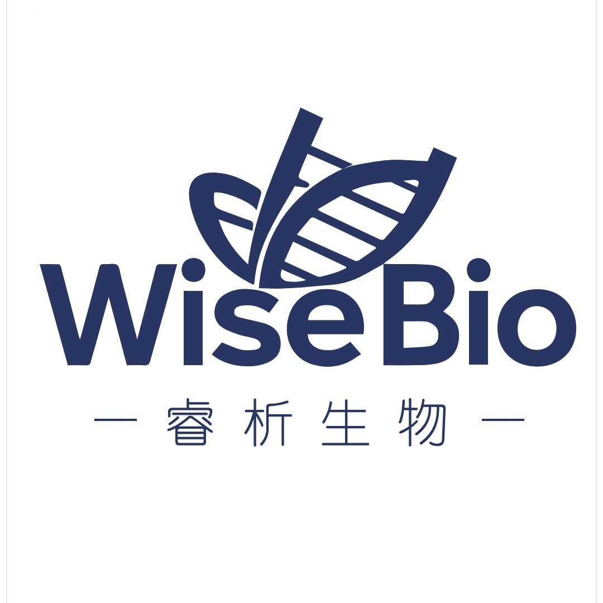

---

### 关于我们 / 核心技术服务

**[睿析生物]** 专注生命科学多组学技术服务，聚焦表观遗传、单细胞、转录组等领域，为高校、临床与药企提供一站式定制化科研解决方案。

**我们提供的核心技术支持：**
*   **表观组学**：cfDNA/DNA甲基化（WGBS/RRBS）、羟甲基化、染色质开放性（ATAC-seq）
*   **转录组学**：m6A/ac4C等RNA修饰检测（acRIP-seq）、单细胞空间转录组
*   **微生物组学**：16S、宏基因组、宏病毒组
*   **多组学联合分析**：提供从实验设计、建库测序到深度生信挖掘的全流程交付

**咨询与合作**
欢迎垂询并定制个性化研究方案，获取专属技术支持：
📞 **电话**：+86 186-XXXX-XXXX
📧 **邮箱**：service@yourcompany.com
💬 **企业微信**：扫码快速对接高级技术顾问

